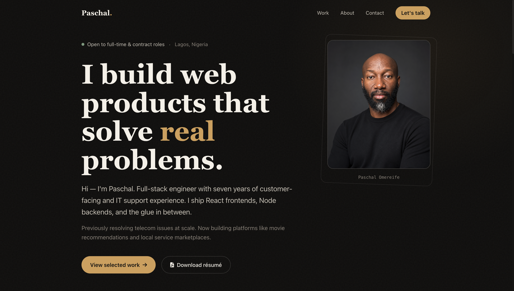
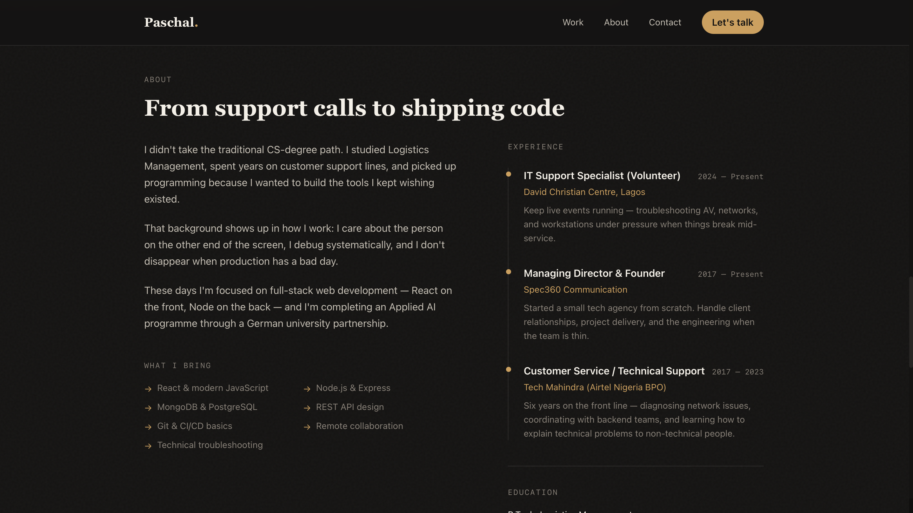
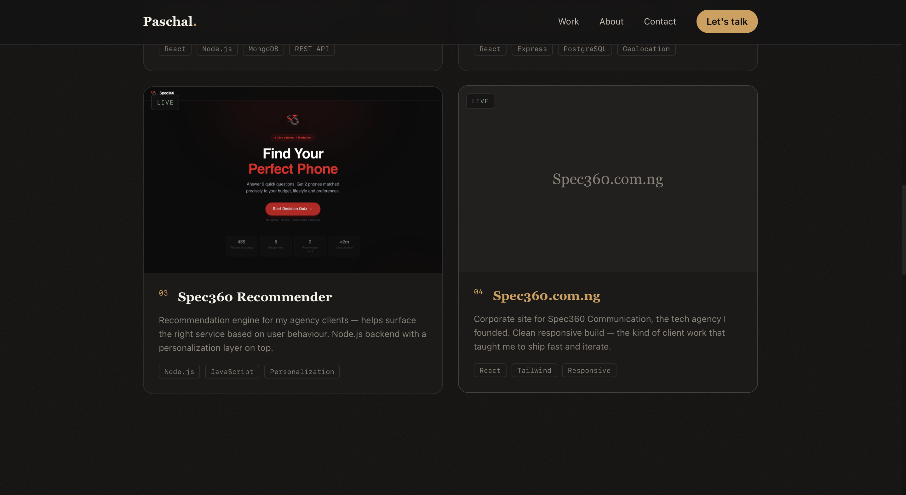
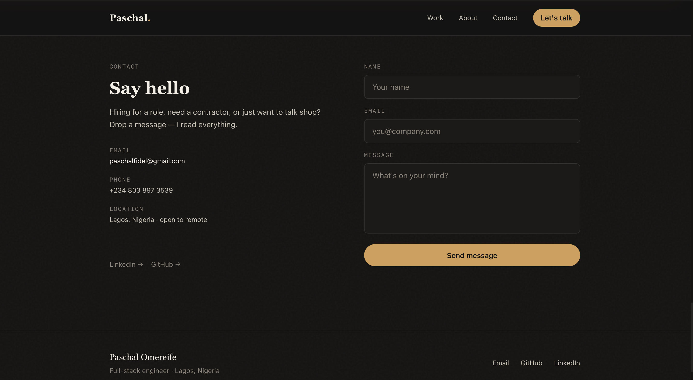

# Paschal Omereife | Full-Stack Software Engineer Portfolio

[](https://paschalomereife.vercel.app)
[](https://react.dev/)
[]
[](https://tailwindcss.com/)
[]
[](https://nodejs.org/)
[]
[](https://www.mongodb.com/)
[](https://vercel.com/)
[](https://render.com/)
[](LICENSE)

> A modern, interactive, full-stack portfolio website showcasing my work, skills, experience, and projects as a Full-Stack Software Engineer.

🔗 **Live Portfolio:** [paschalomereife.vercel.app](https://paschalomereife.vercel.app)

---

## 📸 Screenshots

### 🏠 Homepage



### 👨🏽‍💻 About / Profile



### 🚀 Projects



### 📩 Contact




---

## ✨ Overview

This repository contains the complete source code for my personal portfolio website, including both the **React frontend** and **Node.js/Express backend API**.

The portfolio was designed to provide a professional representation of my technical skills, experience, projects, and services while demonstrating my ability to build and deploy full-stack web applications.

The application combines a modern, highly interactive frontend with a secure backend API responsible for contact form processing, email notifications, database integration, validation, and security.

---

## 🎨 Frontend

The frontend is a responsive React application built with **Vite**, **Tailwind CSS**, and **Framer Motion**.

### Frontend Features

- Modern glassmorphism-inspired interface
- Fully responsive design from mobile to 4K displays
- Custom interactive cursor
- Smooth page and component animations
- Masonry project showcase
- Live project previews using Microlink API
- Lazy loading for images and components
- Code splitting for improved performance
- Image fallback handling
- SEO-friendly metadata
- Open Graph and Twitter card support
- GitHub statistics integration
- Integrated contact form
- Responsive navigation and mobile menu
- Interactive project cards
- Professional skills and experience sections

---

## ⚙️ Backend API

The backend is a Node.js and Express REST API that powers the portfolio's dynamic functionality.

### Backend Features

#### 🔐 Security

- Helmet security headers
- CORS configuration
- Rate limiting
- Input validation and sanitization
- Environment-based configuration
- Centralized error handling

#### 📧 Email System

- Contact form processing
- Email notifications
- Automated user responses
- Structured email templates
- Nodemailer integration

#### 🗄️ Database

- MongoDB Atlas integration
- Mongoose ODM
- Structured data models
- Environment-based database configuration

#### ⚡ Performance & Reliability

- Optimized API responses
- Error handling middleware
- Request logging
- Rate-limit protection
- Environment-specific configuration

---

## 🛠️ Tech Stack

### Frontend

- React 18
- Vite
- JavaScript
- Tailwind CSS
- Framer Motion
- React Masonry CSS
- React Intersection Observer
- Microlink API

### Backend

- Node.js
- Express.js
- MongoDB
- Mongoose
- Nodemailer
- dotenv
- express-rate-limit
- Helmet
- CORS

### Development & Deployment

- Git
- GitHub
- VS Code
- Vercel
- Render
- MongoDB Atlas

---

## 📁 Project Structure

```text
my-portfolio/
│
├── frontend/
│   ├── public/
│   ├── src/
│   │   ├── components/
│   │   ├── data/
│   │   ├── hooks/
│   │   ├── utils/
│   │   ├── App.jsx
│   │   └── main.jsx
│   ├── package.json
│   └── README.md
│
├── backend/
│   ├── controllers/
│   ├── routes/
│   ├── models/
│   ├── middleware/
│   ├── utils/
│   ├── config/
│   ├── server.js
│   └── package.json
│
├── screenshots/
│   ├── homepage.png
│   ├── about.png
│   ├── projects.png
│   └── contact.png
│
├── .gitignore
└── README.md